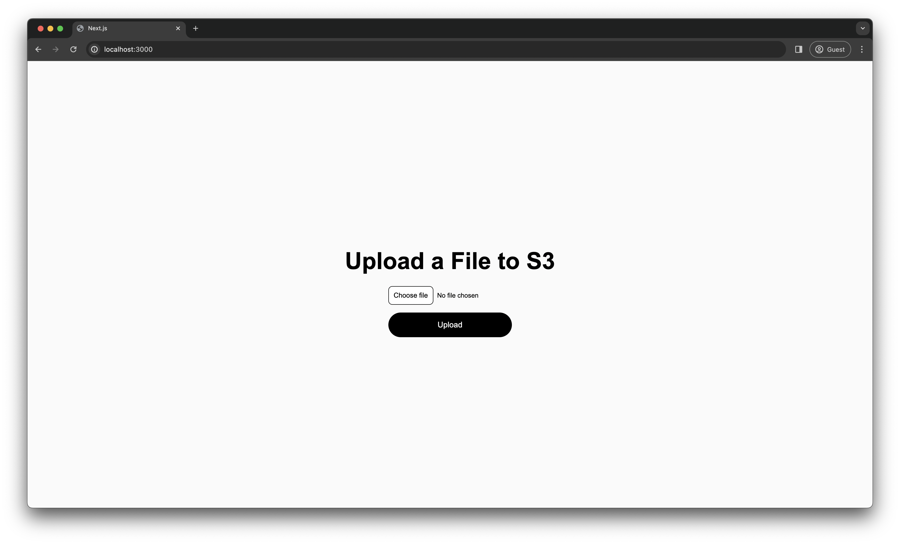

# Upload Images to S3 with Next.js


In this example, we will demonstrate how to upload images to an S3 bucket using Next.js. We will use LocalStack to emulate AWS services locally with AWS SDK for JavaScript.

## Prerequisites

- LocalStack
- Node.js & [`pnpm`](https://pnpm.io/installation)
- Docker
- `awslocal` CLI

## Instructions

You can build and deploy the sample application on LocalStack by running our Makefile commands. To deploy the infrastructure, you can run make deploy after installing the application dependencies. Here are instructions to deploy and test it manually step-by-step.

### Start LocalStack

Start your LocalStack container using the following command:

```bash
EXTRA_CORS_ALLOWED_ORIGINS=* localstack start
```

The `EXTRA_CORS_ALLOWED_ORIGINS` environment variable is used to allow CORS requests from any origin. This is required for the Next.js application to be able to upload images to the S3 bucket.

### Create an S3 Bucket

Before we can upload images to S3, we need to create an S3 bucket. We can do this using the `awslocal` CLI:

```bash
awslocal s3 mb s3://nextjs-s3-image-upload-bucket
```

You can customize the bucket name, but make sure to update the `AWS_BUCKET_NAME` environment variable in the `.env` file.

### Install the Dependencies

Install the dependencies using `pnpm`:

```bash
pnpm install
```

### Start the Application

Start the application using the following command:

```bash
pnpm run dev
```

It will start the Next.js application at [`http://localhost:3000`](http://localhost:3000).



### Upload an Image

Click on the `Upload Image` button to upload an image to the S3 bucket. To inspect the uploaded image, you can use the `awslocal` CLI:

```bash
awslocal s3 ls s3://nextjs-s3-image-upload-bucket
```

You can alternatively use the [LocalStack Web Application](https://app.localstack.cloud) and the [S3 Resource Browser](https://app.localstack.cloud/inst/default/resources/s3) to inspect the uploaded image.
